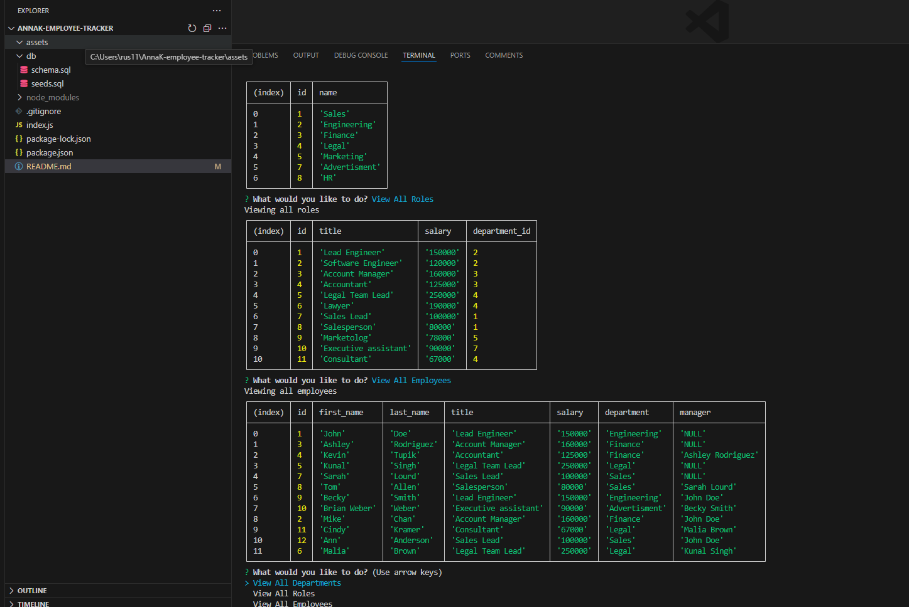

# AnnaK-employee-tracker

## Description

My goal was to create an application "Employee Tracker" using an Node.js, Inquirer, and PostgreSQL.

## Installation

1. Use the command line to navigate the directory of the application
2. Clone this project repo to your computer
3. Install the dependcies "npm install"
4. Run "node index.js"

## Usage

Answer the prompts in the terminal 

## Link to the walkthrough video

To review "AnnaK-employee-tracker", you can click on the link to the walkthrough video and the screenshot link below.

![Link to my video] (https://drive.google.com/file/d/11L50nW-S9lbIprPzJFdG9A-glOb9HIKy/view)

## Screenshots

## Credits

I followed the following resources:

https://nodejs.org/en
https://www.npmjs.com/package/inquirer/v/8.2.4
https://www.npmjs.com/package/pg

